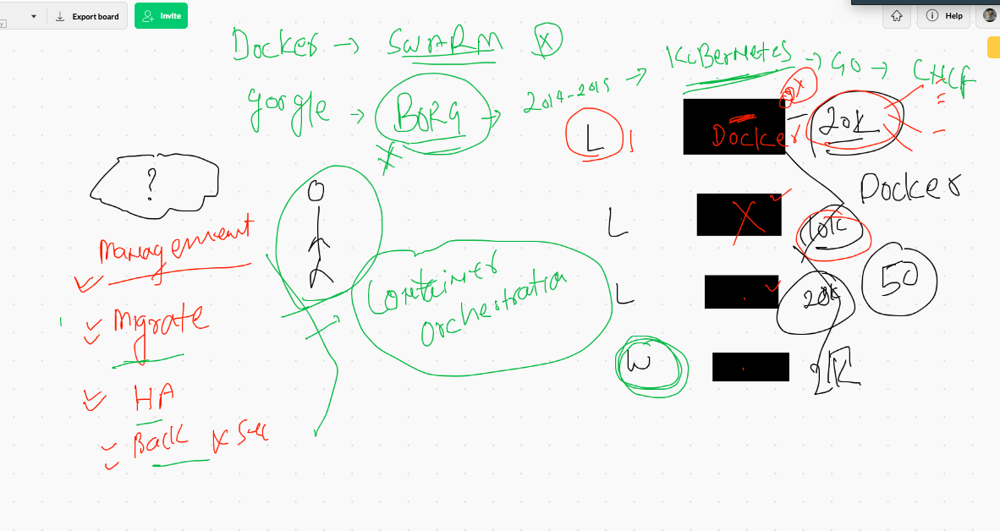
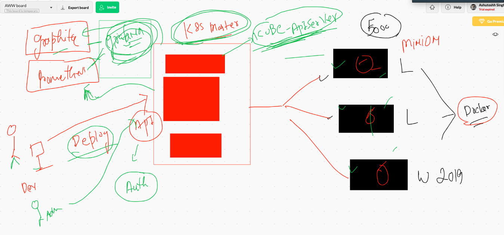
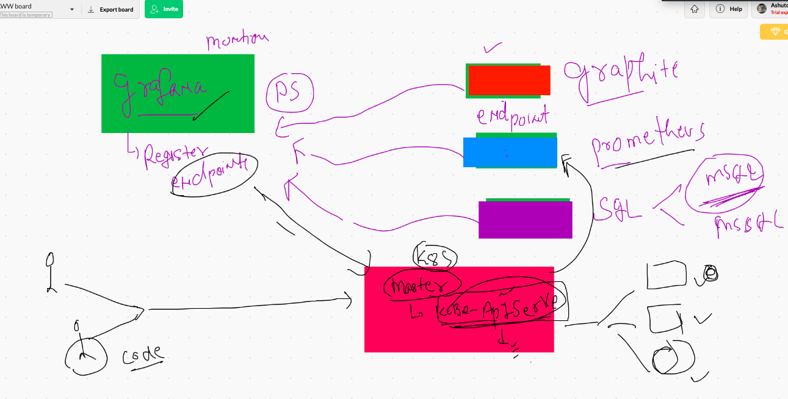
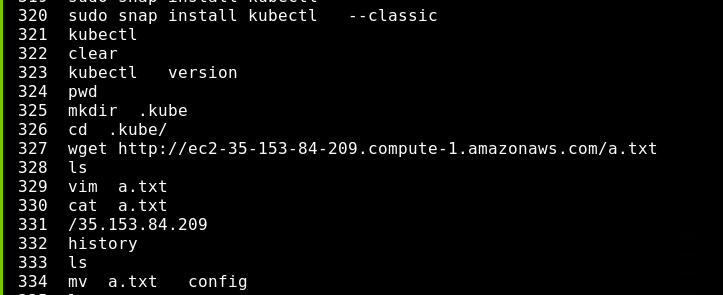
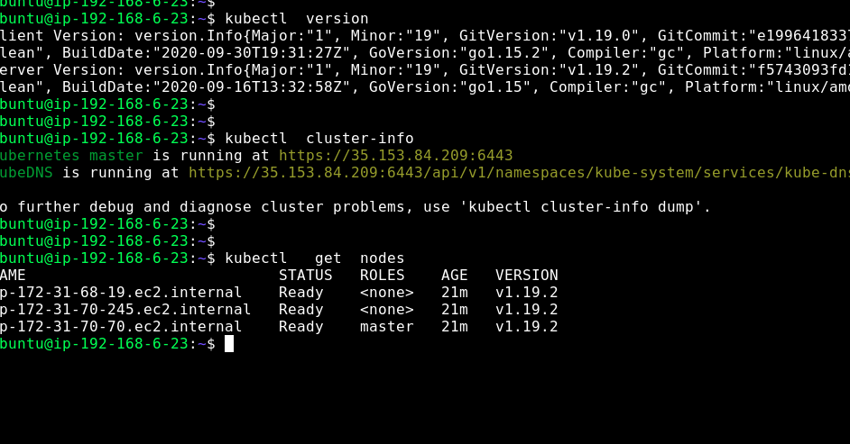
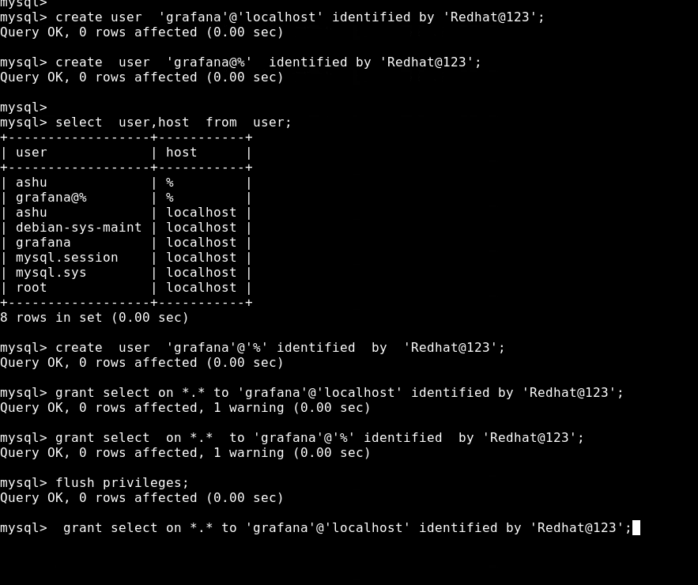

#  Grafana with k8s 

## Info about k8s 

## k8s arch view

## k8s as data source for grafana 

## configure k8s client in grafana server machine 

## verify connection 

# Granfa to mysql  connection. or any db server 

## on the mysql server 

