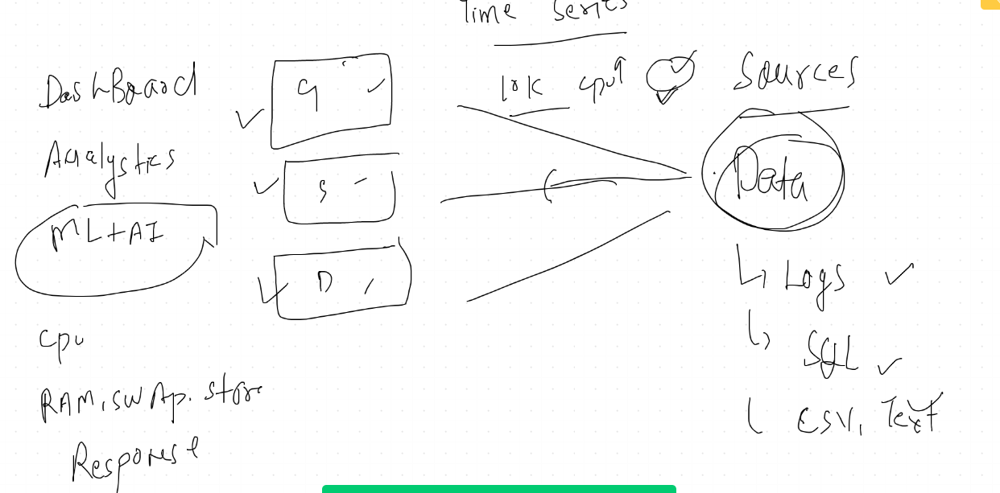
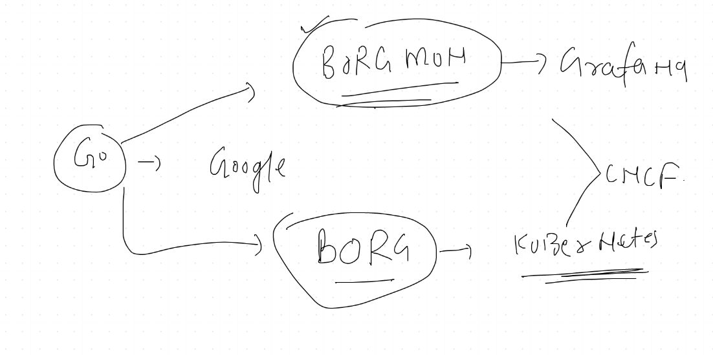
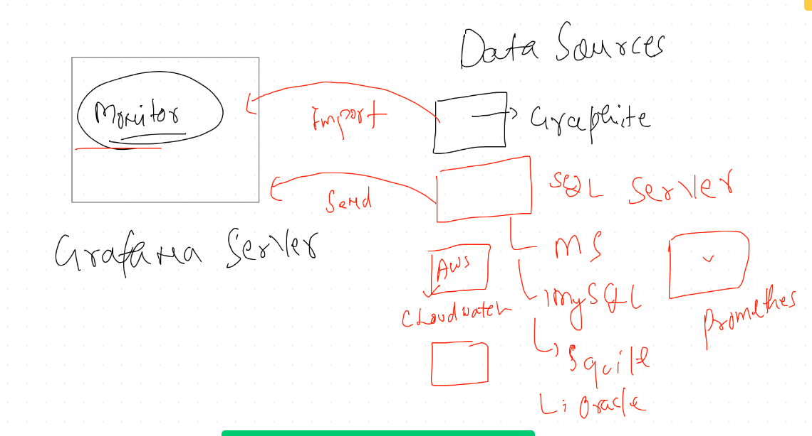
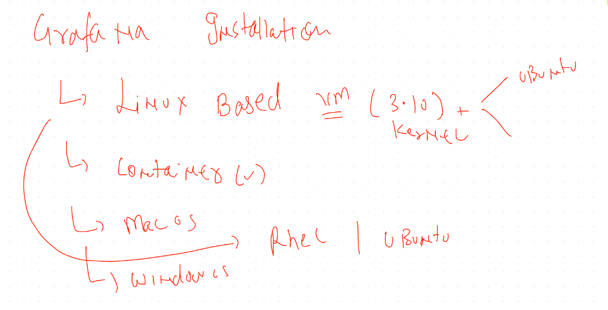
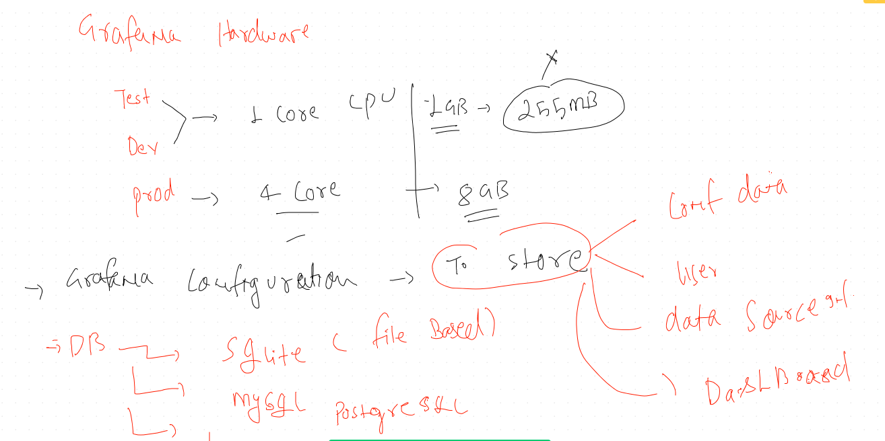
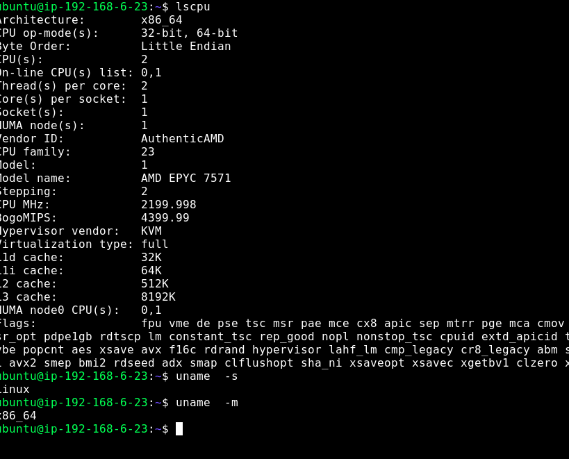
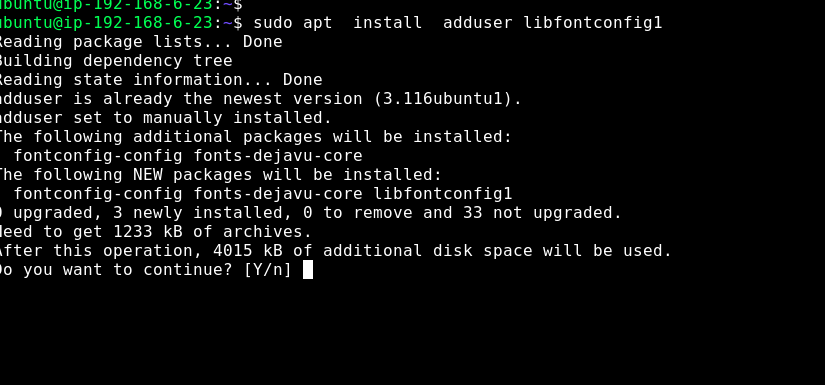
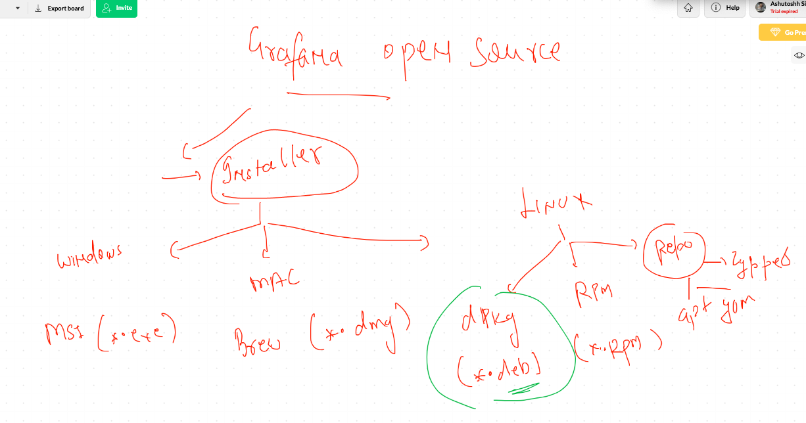
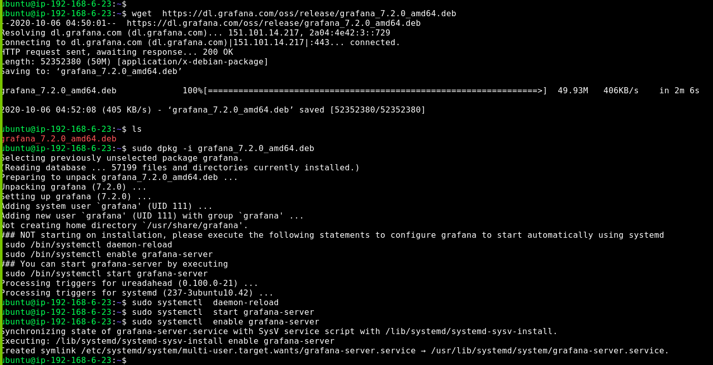

#  Grafana discussion 

## origin of grafana 

## Data sources 

## Installation 

## requirements of grafana to install 

# Installaion on Ubuntu 18

[grafana official link] ('https://grafana.com/grafana/download')

## os Process check 

## installing adduser and fonts

## diff os installer for grafana 

## install and start grafan-server 

