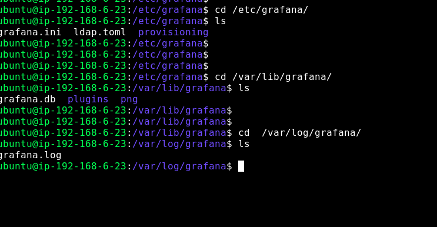
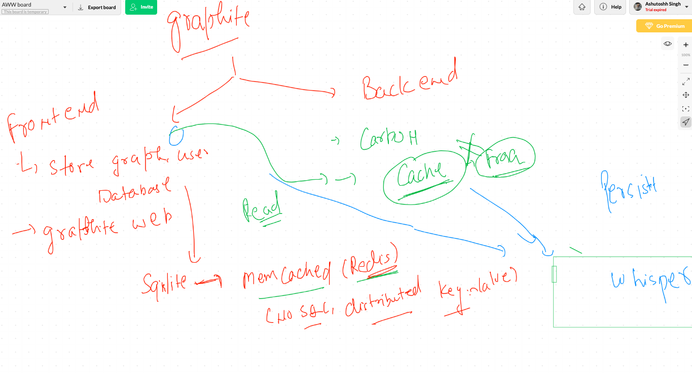
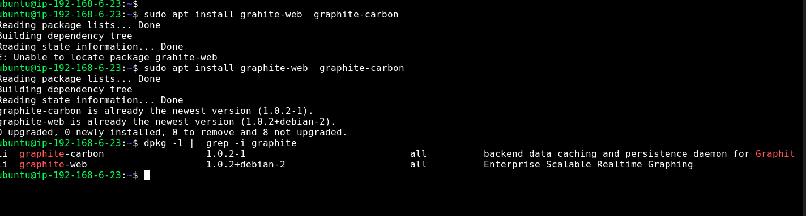
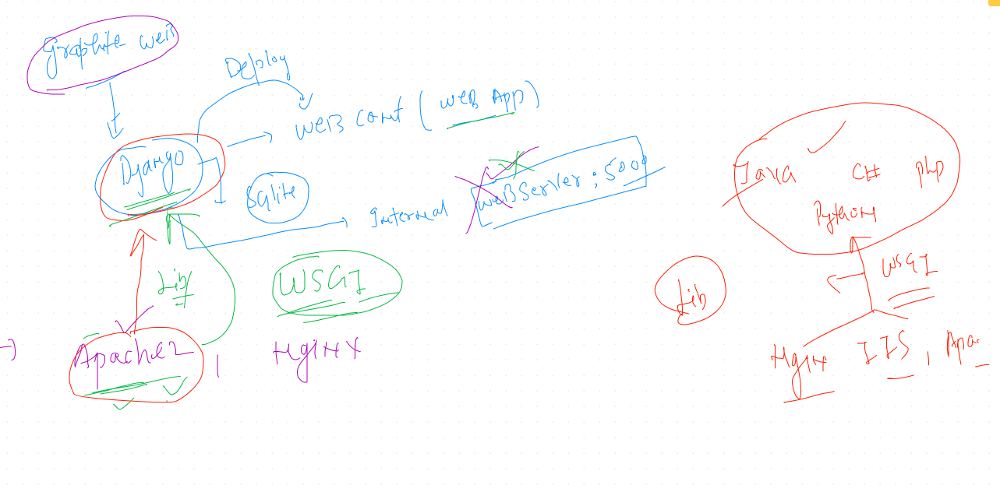
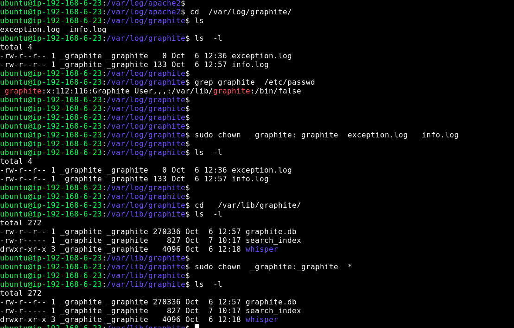

#  Grafana &. Graphite 

## More info about Grafana 

## Configure file  

```
cd /etc/grafana
ls 
grafana.ini

```

## a visual look for more info 



# graphite 

##  graphite frontend and backend 



## install graphite



## graphite djanog concept 



## graphite web ui troubleshooting 


