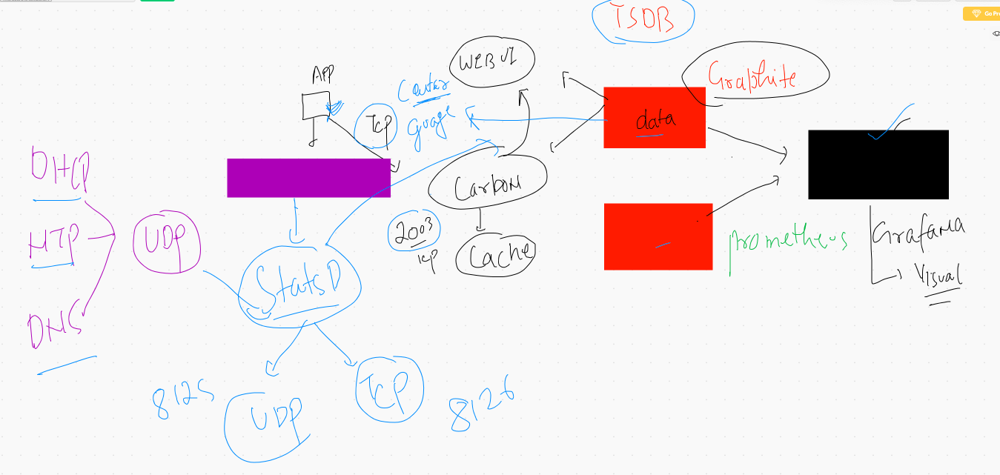
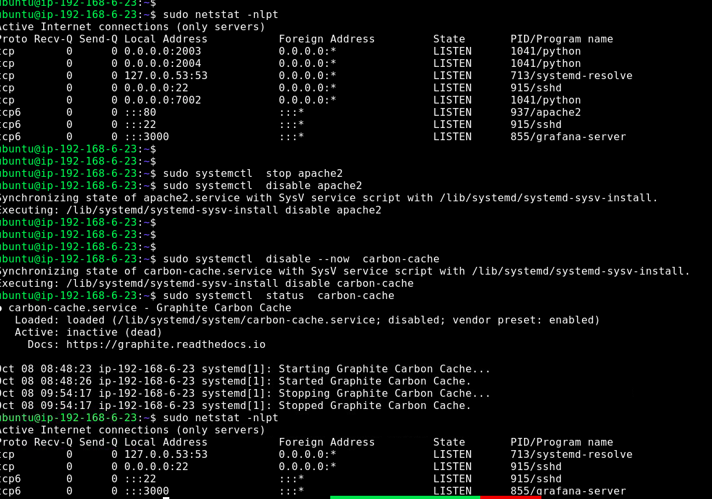
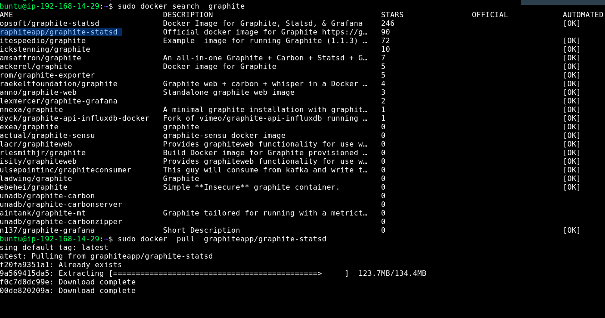
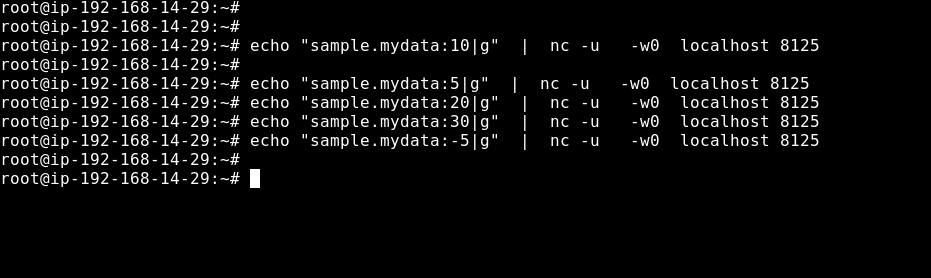
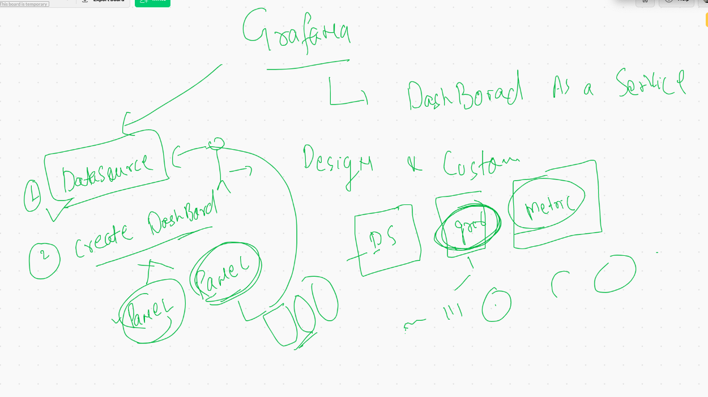
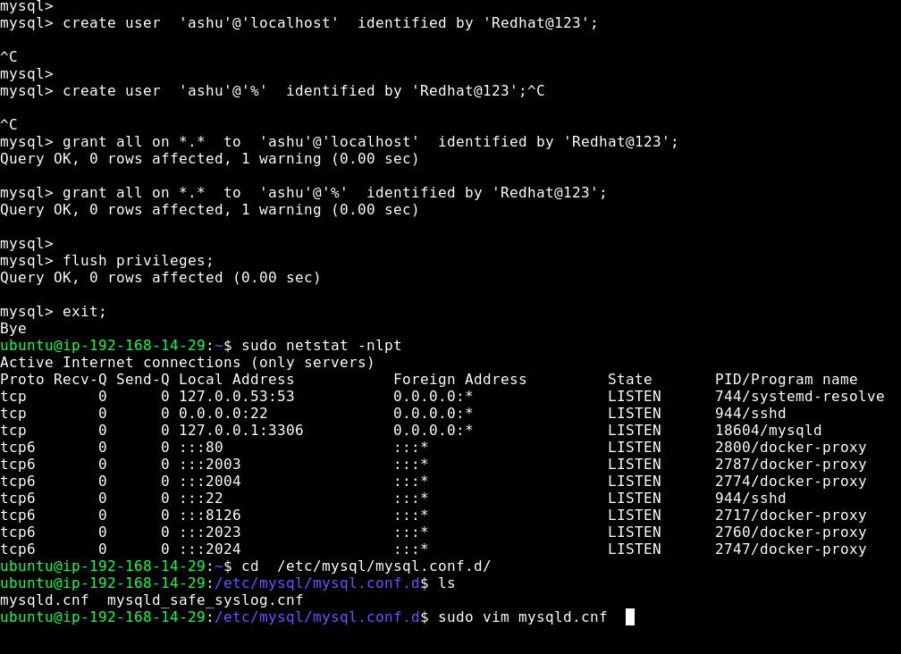
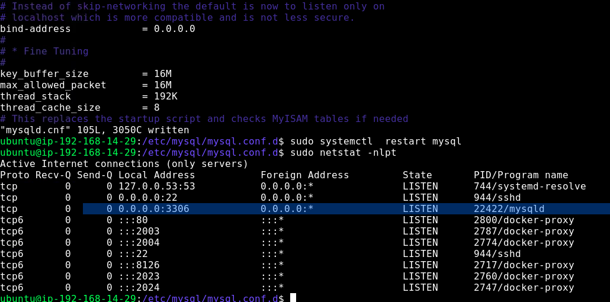

# Graphine in an Image



## More easier way to deploy graphite will be container model 


## stopping graphite related services




## pulling docker image for graphite and statsD



## starting container 

```
sudo docker run --name graphite-statsd  -itd  --restart always  -p 80:80 -p 8125:8125/udp -p 8126:8126 -p 2003-2004:2003-2004 -p 2023-2
024:2023-2024   graphiteapp/graphite-statsd

```

## sending data to carbon using bash / sh 

```
 echo  "stats.ubuntu.tmp.file.count 10 `date +%s`" |  nc  -w0  localhost 2003
```

## sending data to statsD using bash on UDP 




# Grafana 

## creating dashboard 



## Data source. mysql server adding to grafana

### On Machine 2 we are going to install and configure mysql server 

```
sudo apt install mysql-server -y
sudo systemctl start mysql
```
## understanding db concept


## configuring db 



====



