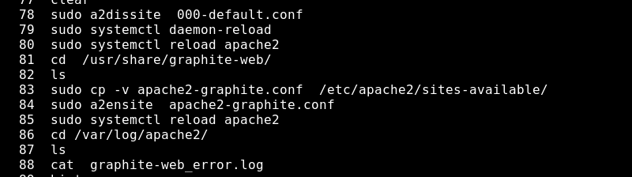

#  Grafana discussion 


## origin of grafana 


## Data sources 


## Installation 


## requirements of grafana to install 


# Installaion on Ubuntu 18

[grafana official link] ('https://grafana.com/grafana/download')

## os Process check 


## installing adduser and fonts


## diff os installer for grafana 


## install and start grafan-server 


# Grafana installation using docker 

## installing docker in ubuntu 18.04

```
sudo snap install docker 
```

---


## running grafana server as container


## data sources info for Grafana


# Data Sources with Graphite 


##  more info about graphite


## Graphite component 

1. graphite-web 
2.  graphite-carbon

## install graphite with apache2 including mod-wsgi 


## migration of graphite related files and info to Django db (squilite by default)


## configure apache2 to host graphite web 



